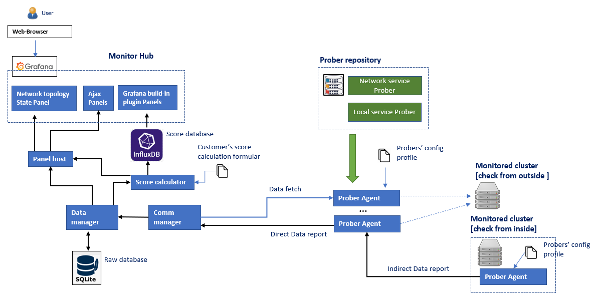
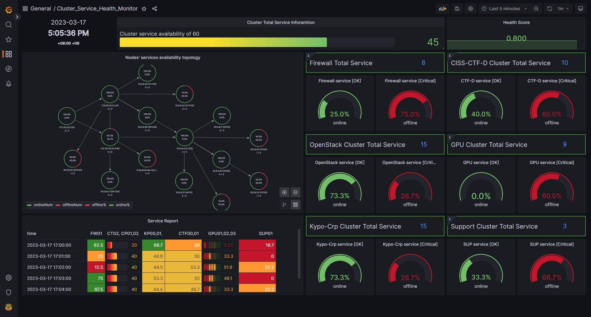
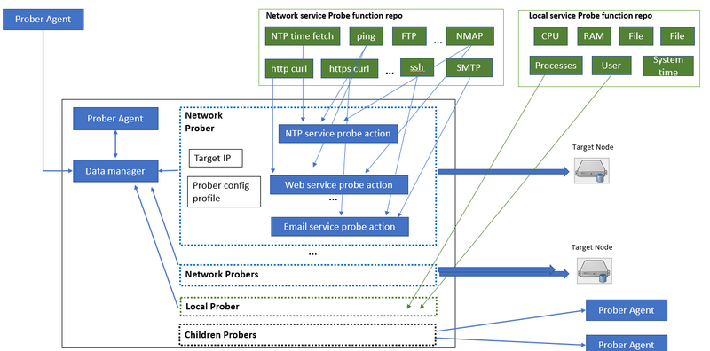
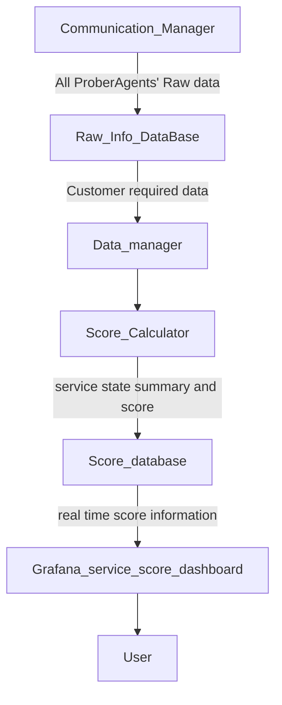
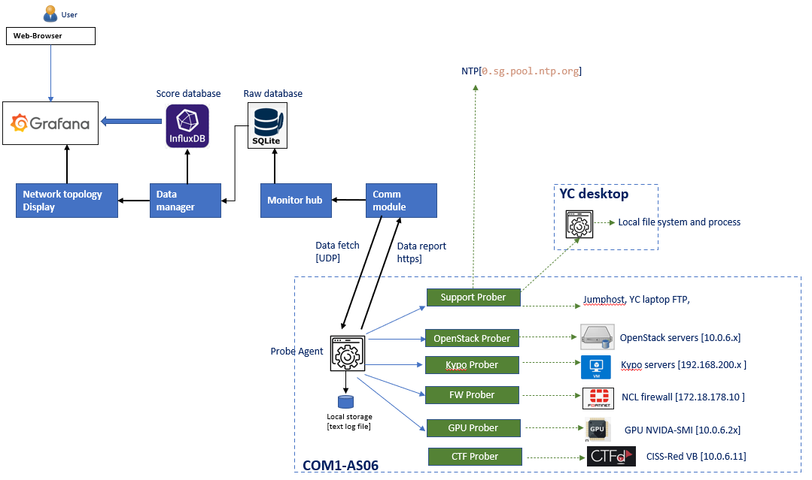
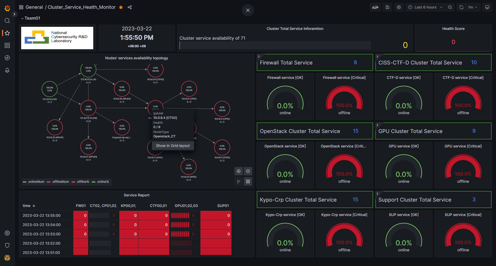

# Cluster Service Health Monitor

**Program Design Purpose** : we want to create a monitor system which can regular check the availability/execution state of each nodes/vms/services/programs used in a computing cluster without doing much change of the routing config of switches in the network or install much additional libs on the nodes. The system can be applied to monitor the below scenario: 

- Monitor the health of the related nodes/services used in a cyber exercise. 
- Monitor whether some attack is happening or has happened on some critical nodes (such as NTP server)/service program of a cluster. 
- Visualize the nodes' status changing during a cyber security drill/events. 

  

[TOC]

------

### Introduction

The Cluster Service Heath Monitor is a system's function/service monitoring program to check and evaluate the cyber security computing cluster's critical points (node, service, function, file system) availability in real time during the cyber exercise. The system contents 3 main parts: 

- **Service Prober Repository** : A service checking lib with server different probers function (such as check NTP, FTP, VNC, ssh ...) to detect whether a specific service/function is working normally.

- **Prober Agent** :  A agent collects and schedule several different kinds of probers to check the entire availably of a small cluster. The prober agent provides below 4 main feature: 

  - It provide a profile configuration function so the user can easily use their customized profile to organize the probers together based his service monitor requirement.  
  - It can run inside the critical node to check the node's local state (such as the node resource usage, file system modification, user login or the program execution state), it can also run outside a node to check the service interface of a node. So the customer can deploy the agent based on his monitor priority instead of deploying agent to every node. 
  - To avoid changing the original routing config of a cluster, a prober agent can also fetch data from another prober to build a data translation bus to make the deployment easier.
  - The prober agent will report the state to the monitor hub for result visualization and analysis. 

- **Monitor Hub** :  A data visualization and analysis system with 2 data bases, it provides a web-based dashboard for user to check the monitored cluster's state and it also provides the interface for user to plug in their score calculation formular/function. 

  

##### System workflow diagram

##### State monitor and score dashboard

`version: v0.1` 

------

### System Design

##### Service Prober Repository

Service Prober Repository is a prober module lib to provide the service/program function check function. The prober function can be categorized to 2 part, local service prober and network probers.

- Local service prober : The local service prober will run inside the target node to monitor the nodes resource usage (CPU%, Memory, Hard disk, user), network state (port opened, connection, NIC I/O state), local program execution state (process) and file system modification.  

  | Prober Name           | Probe action/ service covered                               |
  | --------------------- | ----------------------------------------------------------- |
  | Resource usage Prober | CPU %, Memory %, HardDisk %, Network Bandwidth Usage.       |
  | User action Prober    | User login, cmd execute, file system modification,          |
  | Program action prober | Process execution, service port opened, program  log check. |

- Network service prober: The service prober run outside the target node to check the node's service through network. 

  | Prober Name             | Probe action/ service covered                                |
  | ----------------------- | ------------------------------------------------------------ |
  | Server active Prober    | ICMP (ping), SSH(login), RDP, VNC, X11/X11:1-Win             |
  | Service ports prober    | Nmap check the node's request service ports are opened.      |
  | Service function prober | NTP service prober : Check the NTP service latency and time offset correctness. |
  |                         | DNS/NS service prober: Check the dns service service name mapping correct. |
  |                         | DHCP service prober: Check the dhcp broadcast.               |
  |                         | FTP service prober : Whether can login the FTP server and list the directory tree. |
  |                         | Http/https web prober: Check the webserver can handle request correctly |
  |                         | email service prober: Check whether the email server is working normally. |
  |                         | TCP service prober: Service use TCP connection. (such as MS-Teams service) |
  |                         | UDP service prober: service use UDP connection. (such as Skype service) |
  |                         | Database service prober: Check the database connection.      |

  

##### Prober Agent

A agent collects and schedule several different kinds of probers to check the entire service availably of a small cluster.  The prober agent provides below 5 main feature: 

- It provide a profile configuration function so the user can easily use their customized profile to organize the probers together based his service monitor requirement.  
- It can run inside the critical node to check the node's local state (such as the node resource usage, file system modification, user login or the program execution state), it can also run outside a node to check the service interface of a node. So the customer can deploy the agent based on his monitor priority instead of deploying agent to every node. 
- It also provide the interface for customer to plugin their customized prober function for specific service (such as a billing server)
- To avoid changing the original routing config of a cluster, a prober agent can also fetch data from another prober to build a data translation bus to make the deployment easier.
- The prober agent will report the state to the monitor hub for result visualization and analysis. 

The work flow of prober agent : 

##### Monitor Hub 

The monitor hub is a data visualization and analysis system. It provides a web-based dashboard (currently we use Grafana ) for user to check the monitored cluster's state and it also provides the interface for user to plug in their score calculation formular/function.  

Two data bases will be included  in the program: 

Raw info database: database used to archiving all the collected service data, 

Score database: The data manage will analysis the monitored clusters' availability and calculate the service core based on customer's score calculation function. then save all the data need to be visualized in the score database.  

The data follow of the Monitor hub

------

Use Case;

The Cluster Service Heath Monitor has been deployed on the NCL's AS-06 cluster to monitor 17 nodes with 71 services as shown below: 

| Probed target service cluster | Node number | Service checked                                              |
| ----------------------------- | ----------- | ------------------------------------------------------------ |
| Firewall                      | 1           | icmp, ssh, http-alt, http-proxy, ident, blackice-icecap, http, https |
| Openstack                     | 4           | icmp, ssh, http-alt, upnp, mysql, https, vnc                 |
| Kypo-Crp                      | 3           | icmp, ssh, https, vnc, X11, X11:1-Win                        |
| CTF                           | 2           | icmp, ssh, http, vnc, X11, X11:1-Win                         |
| GPU                           | 3           | icmp, ssh, vnc, Nvidia-smi                                   |
| Support                       | 4           | NTP, ftp, file.                                              |

The detail system workflow is shown as below diagram: 

The monitor dashboard: 

------

> Last edit by LiuYuancheng(liu_yuan_cheng@hotmail.com) at 22/03/2023, if you have any problem or find anu bug, please send me a message .

