# Cyber Exercise Service and Resource Health Monitor

us English | 

**Project Design Purpose** : The Cyber Exercise Service and Resource Health Monitor is designed as an integrated monitoring and observability toolset to support middle-scale cyber exercises and cyber drill events. It is designed to provide the real-time visualization software for showcasing the availability, status, and performance of resources—including hardware, virtual machines (VMs), containers, applications, and software services—throughout the lifecycle of an exercise.

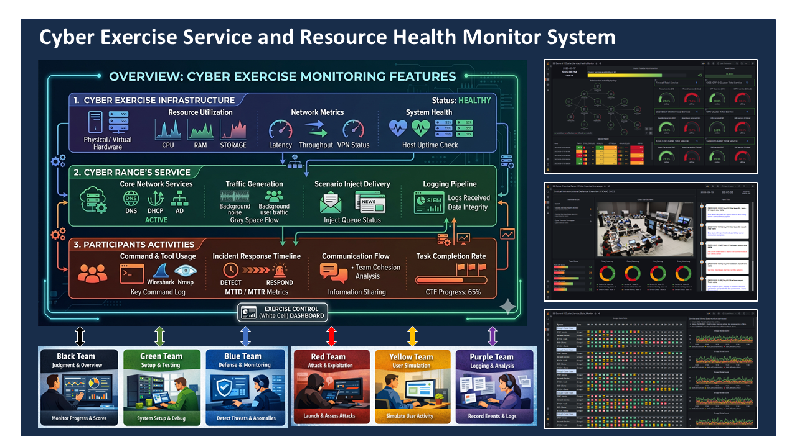

The system is developed to support a range of operational scenarios for different exercise origination and participation teams, particularly in cybersecurity training and simulation environments:

- **Exercise Resource Monitoring** : Track the health and availability of nodes and services used during cyber exercises, ensuring that the environment remains stable and functional.
- **Attack Detection and Impact Awareness** : Identify abnormal behaviors or disruptions in critical services (e.g., NTP servers), which may indicate ongoing or completed possible cyber attacks.
- **Real-Time Visualization** : Observe dynamic changes in node and service states during cybersecurity drills, enabling participants and organizers to understand the evolving situation.

Furthermore, the system incorporates automated mechanisms to detect and record attack activities and corresponding defense actions, enabling accurate event tracking and digital forensic analysis.

```python
# Author:      Yuancheng Liu
# Created:     2026/03/20
# Version:     v_0.0.3
# Copyright:   Copyright (c) 2026 LiuYuancheng
# License:     MIT License
```

**Table of Contents**

[TOC]

- [Cyber Exercise Service and Resource Health Monitor](#cyber-exercise-service-and-resource-health-monitor)
    + [1. Introduction](#1-introduction)
      - [1.1 Abstract and Overview](#11-abstract-and-overview)
      - [1.2 Development and Usage Background](#12-development-and-usage-background)
    + [2. System Overview](#2-system-overview)
      - [2.1 Three Layers System Architecture](#21-three-layers-system-architecture)
      - [2.2 Service Health Monitor Structure](#22-service-health-monitor-structure)
    + [3. System Design](#3-system-design)
      - [3.1 Design of Service Prober Repository](#31-design-of-service-prober-repository)
      - [3.2 Design of Prober Agent](#32-design-of-prober-agent)
      - [3.3 Design of Service Monitor Hub](#33-design-of-service-monitor-hub)
    + [4. Monitor Web Dashboards Portal](#4-monitor-web-dashboards-portal)
      - [4.1 Exercise Overview Dashboard](#41-exercise-overview-dashboard)
      - [4.2 Service Health Dashboard](#42-service-health-dashboard)
      - [4.3 Resource Availability Dashboard](#43-resource-availability-dashboard)
      - [4.4 Information and Announcement Dashboard](#44-information-and-announcement-dashboard)
      - [4.5 Assistance Function Dashboard](#45-assistance-function-dashboard)
    + [5. Use Case Example](#5-use-case-example)
      - [5.1 Monitored Cluster Overview](#51-monitored-cluster-overview)
      - [5.2 Monitor Dashboard Overview](#52-monitor-dashboard-overview)

------

### 1. Introduction

The system is designed to continuously evaluate the execution status/progress of nodes, virtual machines (VMs), services, and application programs, and generates health evaluation scores based on user-defined requirements or preconfigured scoring models. 

#### 1.1 Abstract and Overview

There are several software to monitor the health state of different services in a system or cluster, but currently there are not much software designed to focus on providing real-time visibility into the availability and operational state of a cyber exercises / drills. The key design goal of the Cyber Exercise Service and Resource Health Monitor System is to minimize deployment complexity. It avoids requiring significant modifications to existing network routing configurations (e.g., switches) and reduces the need for installing additional libraries on monitored nodes. This lightweight and flexible approach allows users to rapidly integrate the monitoring system into existing cyber exercise infrastructures, particularly in cyber range and cyber drill environments.

The system supports multiple use cases for different types requirements of exercise teams, including monitoring of infrastructure health during cyber exercises, detection of potential attacks on critical services (such as NTP servers), and visualization of system state transitions during cybersecurity drills and events. 

#### 1.2 Development and Usage Background

Cyber exercise teams are categorized by their roles in simulating, defending against, or managing cybersecurity incidents. The system is developed based on the usage requirements feedback of different teams as shown below:

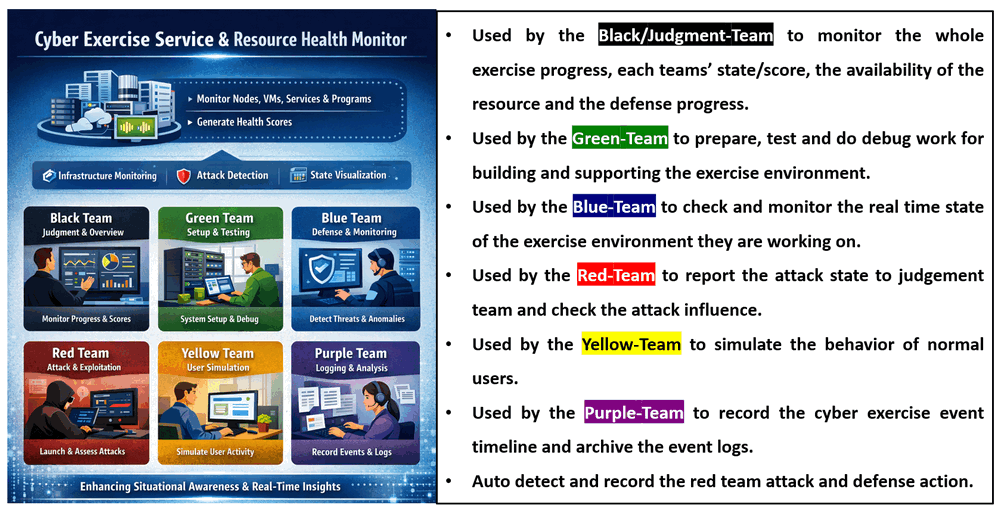

With the function provided by the monitoring system, both the cyber exercise/drill organizers and participants will have a better understand of the progress of the exercise, identify potential issues, and respond effectively. This improves situational awareness, enhances coordination across teams, and ensures the smooth execution of complex cyber range scenarios. The main features and function of the system is designed to fulfill the operational needs of multiple teams involved in cyber exercises:

- **Black (Judgment) Team**: Provides a overview of the entire exercise, including team status, scoring, resource availability, and overall defense progress, enabling accurate evaluation and decision-making. 
- **Green (Setup) Team**: Supports environment setup, testing, and debugging by offering detailed insights into system health and service readiness during preparation and execution phases.
- **Blue (Defense) Team**: Enables real-time monitoring of the infrastructure and services under defense, helping defenders quickly detect anomalies and assess system conditions.
- **Red (Attack) Team**: Assists in reporting attack progress and evaluating the effectiveness and impact of offensive actions on the target environment.
- **Yellow (Operation) Team**: Facilitates the simulation of normal user behavior to enhance realism and provide baseline activity within the exercise environment.
- **Purple (Record) Team**: Records the full timeline of exercise events and archives logs for post-exercise analysis, learning, and improvement.


------

### 2. System Overview

#### 2.1 Three Layers System Architecture 

The system will focus on monitoring three main sections of the cyber exercise from hardware to people : The cyber exercise infra section,  The cyber range's service section and the participants activates section as shown in below feature diagram :

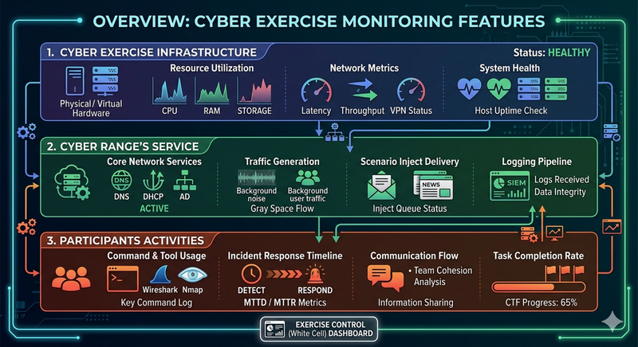

- **Cyber Exercise Infrastructure** :  The "hardware, node and wires" layer includes `Resource Utilization`, `Network Latency & Throughput`, `Connectivity Status` and `Cluster Health/Uptime`. 
- **Cyber Range Resource and Services** : The "software and function services" layer includes `Core Network Services`, `Traffic Generation Integrity`, `Scenario Injection Delivery` and `Logging Pipeline`. 
- **Cyber Drill Participant Activities** : The "User Action" layer of what the participants are doing such as the `Command Line & Tool Usage`, `Incident Response Timeline`, `Communication Flow` and `Task Completion Rate`.

#### 2.2 Service Health Monitor Structure

The Cluster Service Health Monitor will be setup in the second layer which evaluates the availability and integrity of critical components within a cybersecurity computing cluster ( nodes, services, system functions, and file systems). The program module diagram is shown below:

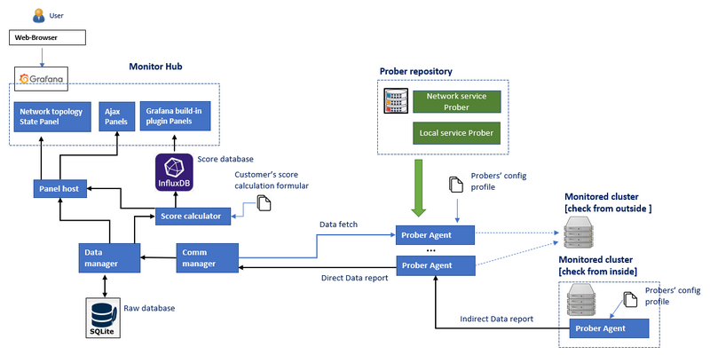

The system is composed of three main modules:

**2.2.1 Service Prober Repository**

A centralized library of service probing functions designed to verify the operational status of various services and protocols such as NTP, FTP, VNC, and SSH. Each prober is responsible for detecting whether a specific service or function is operating normally and responding as expected.

**2.2.2 Prober Agent**

The Prober Agent will import the module from service prober lib to finish the checking tasks across the cluster. The key feature includes:

- **Profile-Based Configuration**: Users can define customized monitoring profiles to group and organize probing functions based on specific requirements.
- **Flexible Deployment Modes**: The agent can operate both internally (within a node) to monitor system-level metrics such as resource usage, file system changes, user activity, and process execution, or externally to assess service interfaces. 
- **Data Translation and Relay**: To avoid modifying existing network routing configurations, the agent can retrieve and relay data from other agents, effectively forming a distributed data collection bus.
- **Centralized Reporting**: All collected monitoring data is sent to the Monitor Hub for visualization and further analysis.

**2.2.3 Monitor Hub**

The Monitor Hub acts as the central platform for data aggregation, visualization, and evaluation. It includes two databases for storing monitoring data and historical raw records. The hub provides:

- A web-based dashboard for real-time visualization of cluster health and service status.
- Interfaces for integrating custom scoring formulas or evaluation functions, allowing users to define how system health is quantified.
- Analytical capabilities to support auto decision-making during cyber exercises.


------

### 3. System Design

#### 3.1 Design of Service Prober Repository

The Service Prober Repository is a modular library that provides probing functions for validating the availability and operational state of services and system components. The probers are categorized into two main types: local service probers and network service probers.

**3.1.1 Local Service Probers**

Local service probers are deployed within target nodes to monitor internal system states. These probers focus on host-level observability, including:

- Resource utilization (CPU, memory, disk, network bandwidth)
- User activities (login, command execution, file modifications)
- Program execution state (running processes, service ports, logs)
- Network interface and connection states

Examples of Local Probers : 

| Prober Name           | Probe Coverage                                             |
| --------------------- | ---------------------------------------------------------- |
| Resource Usage Prober | CPU %, Memory %, Disk usage, Network bandwidth             |
| User Action Prober    | User login, command execution, file system modification    |
| Program Action Prober | Process execution, port status, application log monitoring |

**3.1.2 Network Service Probers**

Network service probers operate externally to assess the target service node's availability through network interfaces. These probers simulate real client interactions and validate service-level functionality.

Examples of Network Probers:

| Prober Name             | Probe Coverage                                      |
| ----------------------- | --------------------------------------------------- |
| Server Active Prober    | ICMP (ping), SSH, RDP, VNC, X11 access              |
| Service Ports Prober    | Port scanning (e.g., Nmap) to verify open ports     |
| Service Function Prober | Functional validation of services such as:          |
|                         | - NTP: latency and time synchronization accuracy    |
|                         | - DNS: name resolution correctness                  |
|                         | - DHCP: broadcast and lease functionality           |
|                         | - FTP: login and directory listing                  |
|                         | - HTTP/HTTPS: web request/response validation       |
|                         | - Email: mail service availability                  |
|                         | - TCP/UDP services: protocol-specific communication |
|                         | - Database: connection and query validation         |

This layered probing design ensures both system-level and service-level visibility across the monitored cluster.

#### 3.2 Design of Prober Agent

The Prober Agent acts as the execution and orchestration layer of the monitoring system. It is responsible for scheduling, managing, and executing multiple probers based on user-defined configurations. It will import the lib module from the `Prober Repository` as shown in the below module import diagram:


**3.2.1 Key Features**

- **Profile-Based Configuration** : Users can define customized monitoring profiles that group different probers according to specific monitoring requirements.

- **Flexible Deployment** : The agent can operate Internally within nodes to monitor local system states or externally from remote nodes to assess service interfaces. 

- **Extensibility via Custom Probers** : Users can integrate custom probing functions tailored to specific services (e.g., proprietary systems like billing servers).
- **Distributed Data Relay Mechanism** : To avoid modifying existing network routing configurations, agents can retrieve data from other agents, forming a data translation bus for efficient data collection.
- **Centralized Reporting** : All collected monitoring data is transmitted to the Monitor Hub for aggregation, analysis, and visualization.

**3.2.2 Program Workflow Overview**

The Prober Agent operates by below sequence :

1. Loading a predefined monitoring profile
2. Scheduling and executing relevant probers
3. Collecting local and/or remote monitoring data
4. Optionally aggregating data from peer agents
5. Sending structured results to the Monitor Hub

#### 3.3 Design of Service Monitor Hub

The Service Monitor Hub is the central component responsible for data aggregation, analysis, scoring, and visualization. It provides users with actionable insights through a web-based dashboard (currently implemented using Grafana).

**3.3.1 Core Functions**

- Real-time visualization of cluster and service health
- Integration of user-defined scoring models
- Historical data storage and analysis
- Support for decision-making during cyber exercises

**3.3.2 Database Architecture**

The Monitor Hub utilizes two dedicated databases:

- **Raw Information Database** : Stores all collected raw monitoring data from Prober Agents for archival and traceability purposes.
- **Score Database** : Stores processed data, including computed service availability scores and summarized system states, based on user-defined scoring functions.

**3.3.3 Data Flow Architecture**

The data processing pipeline within the Monitor Hub is illustrated below:

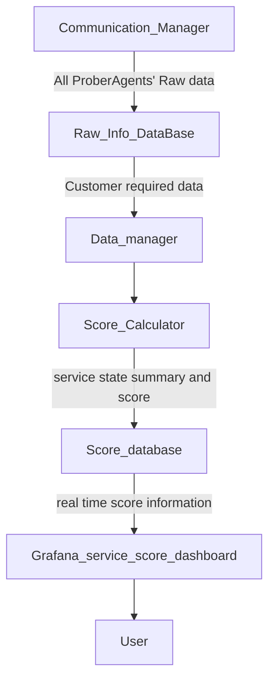
```mermaid
graph TD;
	Communication_Manager -- All ProberAgents' Raw data --> Raw_Info_DataBase;
	Raw_Info_DataBase -- Customer required data --> Data_manager;
	Data_manager --> Score_Calculator;
	Score_Calculator -- service state summary and score --> Score_database;
	Score_database -- real time score information --> Grafana_service_score_dashboard;
	Grafana_service_score_dashboard --> User;
```

**3.3.4 Data Flow Description**

1. **Data Collection**: Prober Agents send raw monitoring data to the Communication Manager.
2. **Data Storage**: Raw data is stored in the Raw Information Database.
3. **Data Processing**: The Data Manager retrieves relevant data based on user requirements.
4. **Score Calculation**: The Score Calculator applies user-defined formulas to compute service health scores.
5. **Data Visualization**: Processed results are stored in the Score Database and displayed in real time via the Grafana dashboard.
6. **User Interaction**: Users access insights through an intuitive web interface.


------

### 4. Monitor Web Dashboards Portal 

The system provides a suite of web-based dashboards to visualize real-time exercise information and support the operational needs of different teams. Each dashboard is designed with role-specific views to enhance situational awareness, coordination, and decision-making during cyber exercises. The screen shot examples is shown below: 

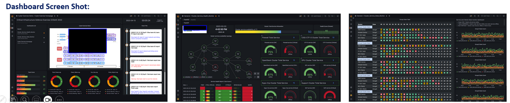

Currently, five main types of dashboards are supported:

- Exercise Overview Dashboard - Black (Judgment) Team
- Service Health Dashboard - Blue Team
- Resource Availability Dashboard  - Black (Judgment), Red, Blue, and Purple Teams
- Information and Announcement Dashboard - Purple Team (Primary), All Teams (Consumers)
- Assistance Function Dashboards - Green Team and Yellow Team


#### 4.1 Exercise Overview Dashboard

The Cyber Exercise Overview Dashboard is primarily used by the Black (Judgment) Team to monitor, manage, and control the overall progress of the cyber exercise. It provides a centralized, real-time view of key operational metrics and event status, enabling effective decision-making and coordination. The dashboard screen shot example is shown below:

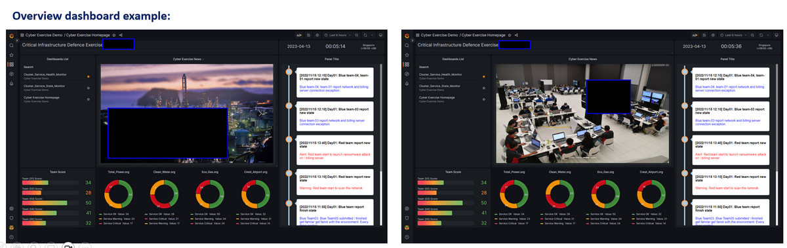

The dashboard includes the following information Panels :

- **Latest Updates and Live Feed**: Displays the latest news, announcements, and live video from the exercise venue.
- **Attack and Defense Status**: Visualizes the current state of ongoing attack and defense activities across the exercise environment.
- **Team Performance and Scoring**: Panel shows the scores of all Blue Teams, along with a summary of tickets raised and resolved during the exercise.
- **Resource Availability Overview**: Provides a high-level view of the availability and health of resources across all participating teams.
- **Real-Time Event Timeline**: Tracks and displays key exercise events as they occur, offering a chronological view of activities and incidents.


#### 4.2 Service Health Dashboard

The Cyber Exercise Service Health Dashboard is designed for the Blue Team to monitor the health, availability, and operational status of the sub-exercise environment or cluster under their responsibility. It provides real-time insights that enable defenders to analyze system conditions, detect anomalies, raise incident tickets, and plan appropriate defense actions. The dashboard screen shot is shown below:

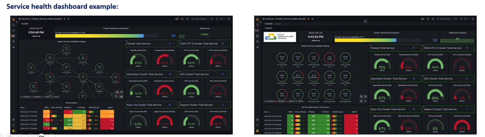

Each Blue Team is provided with a dedicated dashboard tailored to their assigned environment. The dashboard provides the following key information:

- **Node Health and Availability**: Real-time status of nodes within the cluster, including uptime and operational health.
- **Network Topology and Traffic State**: Visualization of the environment’s network structure along with current traffic conditions and potential anomalies.
- **Service and Application Status**: Monitoring of service availability and program execution states across the clusters.
- **Critical Host Activity Monitoring**: Tracking of login activities and command executions on critical nodes for security auditing and anomaly detection.
- **System Logs and Defense Score**: Access to cluster system logs and the current defense score of the team for performance tracking.


#### 4.3 Resource Availability Dashboard

The Resource Availability Dashboard provides a detailed, real-time view of the availability and status of all exercise resources, including hardware, virtual machines (VMs), containers, applications, and services. It is designed to support the operational and analytical needs of multiple teams involved in the cyber exercise. The dashboard screen shot is shown below:

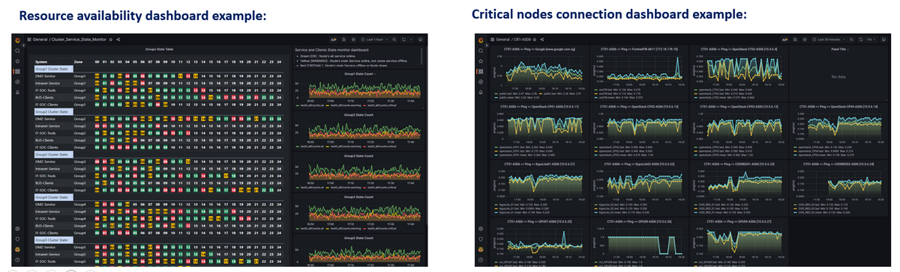

This dashboard enables different teams to perform the following functions:

- **Black (Judgment) Team**: Evaluate team performance by analyzing resource availability, system states, and the impact of actions on overall scoring and exercise progress.
- **Red Team**: Assess the effectiveness and impact of launched attacks by observing changes in resource availability and system behavior within the target environment.
- **Green Team**: Monitor connectivity and health of critical nodes and hosts, supporting environment validation, troubleshooting, and debugging of issues during the exercise.
- **Purple Team**: Archive and review the overall resource state of the exercise environment for post-event analysis, reporting, and knowledge retention.


#### 4.4 Information and Announcement Dashboard

The Information and Announcement Dashboard is primarily managed by the Purple Team and serves as the central communication and information portal for the cyber exercise. It is used to publish announcements, share updates with participating teams (especially the Blue Team), archive exercise-related materials, and provide selected information to the public as a homepage interface. The dashboard screen shot is shown below:

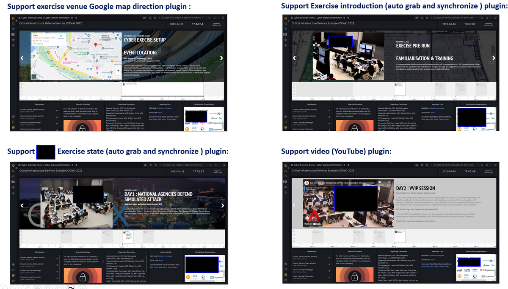

This dashboard ensures consistent communication, improves information accessibility, and supports both real-time coordination and post-exercise documentation. The dashboard includes the following panels:

- **Event Schedule Timeline Panel** : Displays the overall schedule of the exercise, including key milestones and planned activities.
- **Exercise Progress Timeline Panel** : Provides a real-time timeline of exercise events using the new timeline system, allowing users to track ongoing activities and incidents.
- **Dashboard List Panel** : Offers quick access to all available monitoring dashboards within the system.
- **Exercise Schedule Panel** : Presents detailed scheduling information, including session breakdowns and timing for specific activities.
- **Organizing Committee Panel** : Introduces the organizing team and key stakeholders involved in the exercise.
- **Exercise Document Download Panel** : Provides access to relevant documents, guidelines, and resources for participants.
- **Participating Organizations Display Panel** : Showcases the organizations involved in the exercise, supporting visibility and collaboration.


#### 4.5 Assistance Function Dashboard

The Assistance Function Dashboard consists of a set of customized dashboards designed to visualize the execution state of specific functions that fulfill additional operational requirements of the cyber exercise. These dashboards provide targeted support for specialized teams by offering real-time insights into auxiliary systems and activities. The dashboard screen shot is shown below:

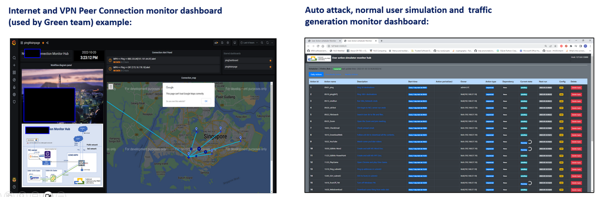

The dashboards include:

- **User Behavior Simulation Dashboard (Yellow Team)** : Displays the status of normal user behavior simulations and traffic generation activities, helping to maintain realistic baseline conditions within the exercise environment.
- **Attack Activity Monitoring Dashboard (Red Team)** : Visualizes ongoing attack operations, including launched attacks and automatically triggered unexpected or potentially harmful actions, enabling better tracking and reporting of offensive activities.
- **Connectivity and Network Support Dashboard (Green Team)** : Monitors internet connectivity, VPN status, and bandwidth usage to ensure stable infrastructure and network support throughout the exercise.


------

### 5. Use Case Example 

The **Cluster Service Health Monitor** has been successfully deployed on the NCL **AS-06 cluster (COM1-AS06)** to demonstrate its capability in monitoring a mid-sized cyber exercise environment. In this deployment, the system monitors a total of **17 nodes** and **71 services** across multiple critical infrastructure components. The detail system workflow is shown as below diagram: 

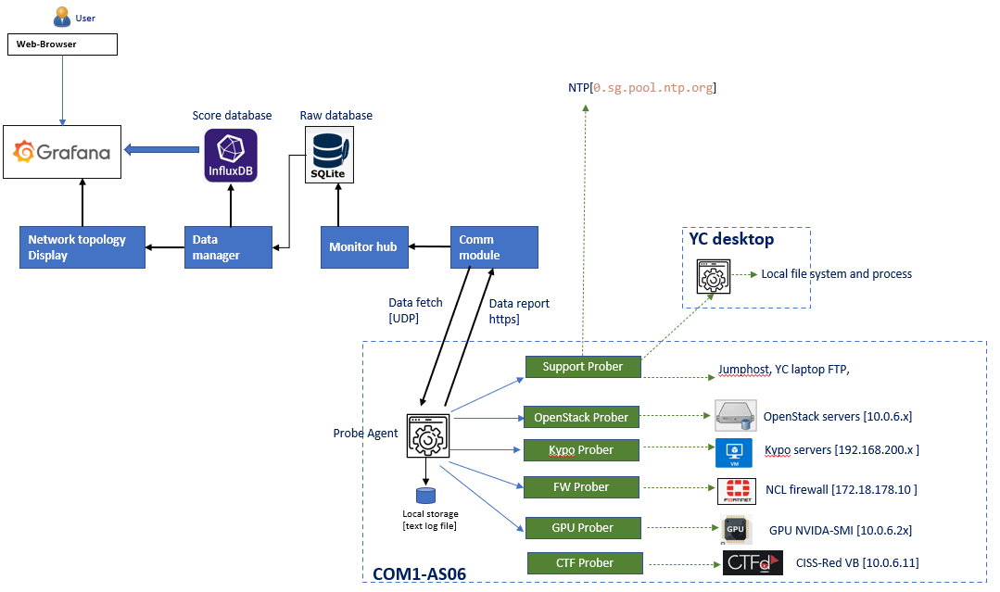

#### 5.1 Monitored Cluster Overview

The monitored targets and services are summarized below:

| Probed target service cluster | Node number | Service checked                                              |
| ----------------------------- | ----------- | ------------------------------------------------------------ |
| Firewall                      | 1           | icmp, ssh, http-alt, http-proxy, ident, blackice-icecap, http, https |
| Openstack                     | 4           | icmp, ssh, http-alt, upnp, mysql, https, vnc                 |
| Kypo-Crp                      | 3           | icmp, ssh, https, vnc, X11, X11:1-Win                        |
| CTF                           | 2           | icmp, ssh, http, vnc, X11, X11:1-Win                         |
| GPU                           | 3           | icmp, ssh, vnc, Nvidia-smi                                   |
| Support                       | 4           | NTP, ftp, file.                                              |

#### 5.2 Monitor Dashboard Overview

The monitor dashboard: 

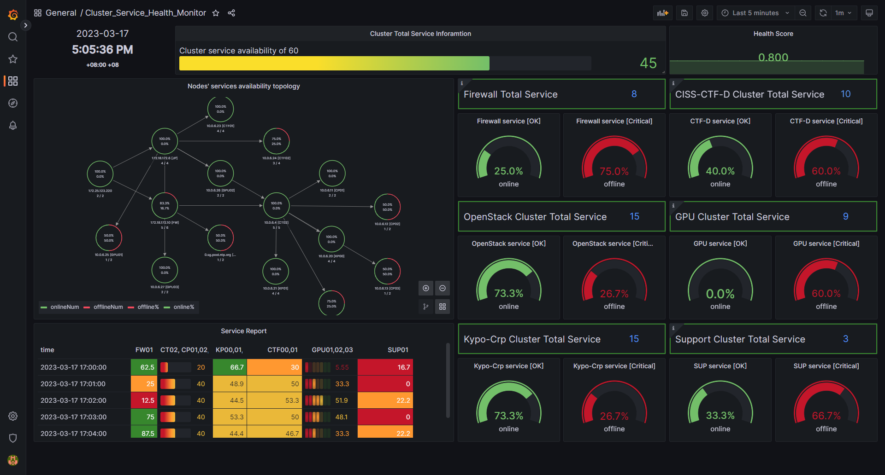

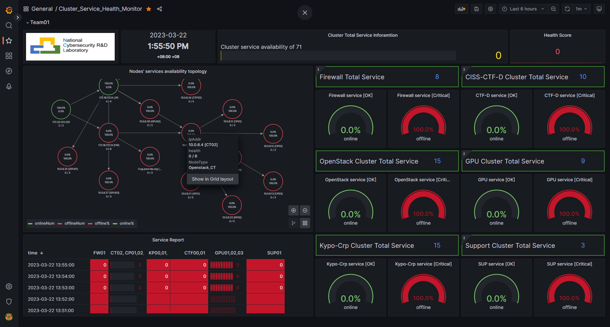


------

> Last edit by LiuYuancheng (liu_yuan_cheng@hotmail.com) at 22/03/2026, if you have any problem or find anu bug, please send me a message .
