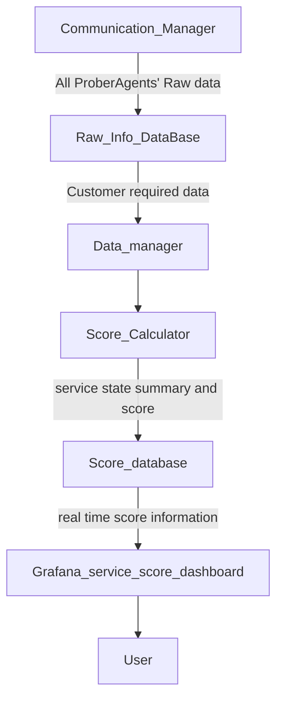
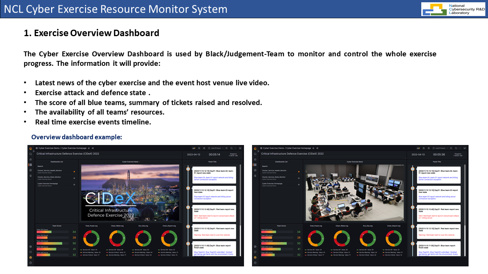
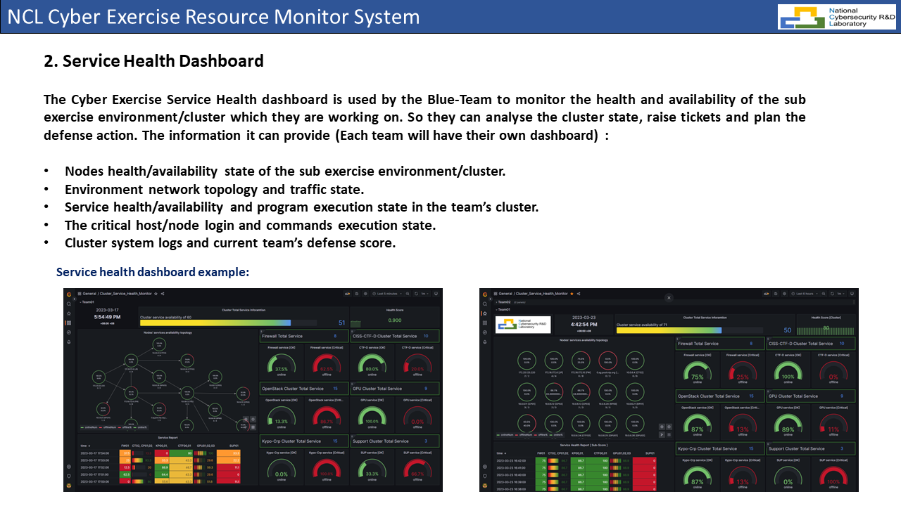
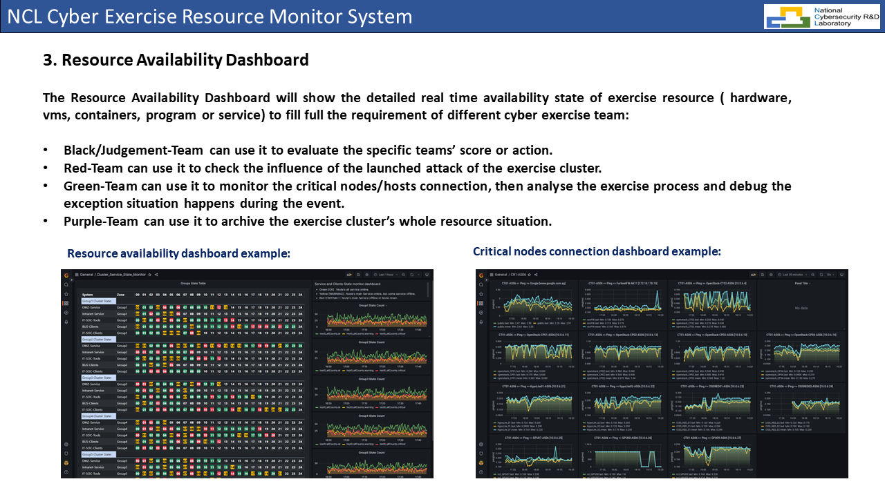
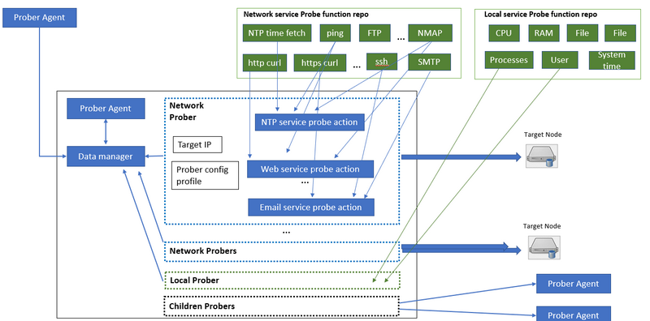

# Cyber Exercise Service and Resource Health Monitor

us English | 

**Project Design Purpose** : The Cyber Exercise Service and Resource Health Monitor is designed as an integrated monitoring and observability toolset to support middle-scale cyber exercises and cyber drill events. It is designed to provide real-time Visualization software for showcasing the availability, status, and performance of critical resources—including hardware, virtual machines (VMs), containers, applications, and services—throughout the lifecycle of an exercise.

The system is designed to support a range of operational scenarios for different exercise origination and participation team, particularly in cybersecurity training and simulation environments:

- **Cyber Exercise Monitoring**: Track the health and availability of nodes and services used during cyber exercises, ensuring that the environment remains stable and functional.
- **Attack Detection and Impact Awareness**: Identify abnormal behaviors or disruptions in critical services (e.g., NTP servers), which may indicate ongoing or completed cyber attacks.
- **Real-Time Visualization**: Observe dynamic changes in node and service states during cybersecurity drills, enabling participants and organizers to understand the evolving situation.

Furthermore, the system incorporates automated mechanisms to detect and record attack activities and corresponding defense actions, enabling accurate event tracking and forensic analysis.

```python
# Author:      Yuancheng Liu
# Created:     2026/03/20
# Version:     v_0.0.3
# Copyright:   Copyright (c) 2026 LiuYuancheng
# License:     MIT License
```

**Table of Contents**

[TOC]

------

### 1. Introduction

The Cyber Exercise Service and Resource Health Monitor System is designed to continuously evaluate the execution status/progress of nodes, virtual machines (VMs), services, and application programs, and generates health evaluation scores based on user-defined requirements or preconfigured scoring models.

#### 1.1 Abstract and Overview

There are several software to monitor the health state of different services in a system, but currently there are not much system designed to focus on providing real-time visibility into the availability and operational state of a cyber exercises / drills. The key design goal of the Cyber Exercise Service and Resource Health Monitor System is to minimize deployment complexity. It avoids requiring significant modifications to existing network routing configurations (e.g., switches) and reduces the need for installing additional libraries on monitored nodes. This lightweight and flexible approach allows users to rapidly integrate the monitoring system into existing infrastructures, particularly in cyber range and cyber exercise environments.

The system supports multiple critical use cases for different types requirements of exercise teams, including real-time monitoring of infrastructure health during cyber exercises, detection of potential attacks on critical services (such as NTP servers), and visualization of system state transitions during cybersecurity drills and events. 

#### 1.2 Development and Usage Background

Cyber exercise teams are categorized by their roles in simulating, defending against, or managing cybersecurity incidents. The system is developed based on the usage requirement feedback of different team as shown below:


With the function provided by the monitoring system, both the cyber exercise/drill organizers and participants will have a better understand of real-time progress of the exercise, identify potential issues, and respond effectively. This improves situational awareness, enhances coordination across teams, and ensures the smooth execution of complex cyber range scenarios. The main features and function of the system is designed to fulfill the operational needs of multiple teams involved in cyber exercises:

- **Black (Judgment) Team**: Provides a overview of the entire exercise, including team status, scoring, resource availability, and overall defense progress, enabling accurate evaluation and decision-making. 
- **Green (Setup) Team**: Supports environment setup, testing, and debugging by offering detailed insights into system health and service readiness during preparation and execution phases.
- **Blue (Defense) Team**: Enables real-time monitoring of the infrastructure and services under defense, helping defenders quickly detect anomalies and assess system conditions.
- **Red (Attack) Team**: Assists in reporting attack progress and evaluating the effectiveness and impact of offensive actions on the target environment.
- **Yellow (Operation) Team**: Facilitates the simulation of normal user behavior to enhance realism and provide baseline activity within the exercise environment.
- **Purple (Record) Team**: Records the full timeline of exercise events and archives logs for post-exercise analysis, learning, and improvement.

By combining lightweight deployment, flexible monitoring capabilities, and real-time visualization, the system enhances situational awareness and operational efficiency in complex cyber range environments.


------

### 2. System Overview

#### 2.1 Three Layers System Architecture 

The system will focus on monitoring three main sections of the cyber exercise: the cyber exercise infra,  the cyber range's service and the participants activates as shown below:


- **Cyber Exercise Infrastructure** :  The "hardware, node and wires" layer includes Resource Utilization, Network Latency & Throughput, Connectivity Status and System Health/Uptime. 
- **Cyber Range Resource and Services** : The "software and function services" layer includes Core Network Services, Traffic Generation Integrity, Scenario Injection Delivery and Logging Pipeline. 
- **Cyber Drill Participant Activities** : The "User Action" layer of what the participants are doing such as the Command Line & Tool Usage, Incident Response Timeline, Communication Flow and Task Completion Rate

#### 2.2 Service Health Monitor Structure

The Cluster Service Health Monitor is the system setup for the second layer  which evaluates the availability and integrity of critical components within a cybersecurity computing cluster. These components include nodes, services, system functions, and file systems. The system module diagram is shown below:


The system is composed of three main modules:

**2.2.1 Service Prober Repository**

A centralized library of service probing functions designed to verify the operational status of various services and protocols. These include, but are not limited to, NTP, FTP, VNC, and SSH. Each prober is responsible for detecting whether a specific service or function is operating normally and responding as expected.

**2.2.2 Prober Agent**

The Prober Agent is responsible for orchestrating and executing probing tasks across the cluster. It provides several key capabilities:

- **Profile-Based Configuration**: Users can define customized monitoring profiles to group and organize probing functions based on specific requirements.
- **Flexible Deployment Modes**: The agent can operate both internally (within a node) to monitor system-level metrics such as resource usage, file system changes, user activity, and process execution, and externally to assess service interfaces. This flexibility reduces the need to deploy agents on every node.
- **Data Translation and Relay**: To avoid modifying existing network routing configurations, the agent can retrieve and relay data from other agents, effectively forming a distributed data collection bus.
- **Centralized Reporting**: All collected monitoring data is sent to the Monitor Hub for visualization and further analysis.

**2.2.3 Monitor Hub**

The Monitor Hub acts as the central platform for data aggregation, visualization, and evaluation. It includes two databases for storing monitoring data and historical records. The hub provides:

- A web-based dashboard for real-time visualization of cluster health and service status.
- Interfaces for integrating custom scoring formulas or evaluation functions, allowing users to define how system health is quantified.
- Analytical capabilities to support decision-making during cyber exercises.


------

### 3. System Design

#### 3.1 Design of Service Prober Repository

The Service Prober Repository is a modular library that provides probing functions for validating the availability and operational state of services and system components. The probers are categorized into two main types: local service probers and network service probers.

**3.1.1 Local Service Probers**

Local service probers are deployed within target nodes to monitor internal system states. These probers focus on host-level observability, including:

- Resource utilization (CPU, memory, disk, network bandwidth)
- User activities (login, command execution, file modifications)
- Program execution state (running processes, service ports, logs)
- Network interface and connection states

Examples of Local Probers : 

| Prober Name           | Probe Coverage                                             |
| --------------------- | ---------------------------------------------------------- |
| Resource Usage Prober | CPU %, Memory %, Disk usage, Network bandwidth             |
| User Action Prober    | User login, command execution, file system modification    |
| Program Action Prober | Process execution, port status, application log monitoring |

**3.1.2 Network Service Probers**

Network service probers operate externally to assess service availability through network interfaces. These probers simulate real client interactions and validate service-level functionality.

Examples of Network Probers:

| Prober Name             | Probe Coverage                                      |
| ----------------------- | --------------------------------------------------- |
| Server Active Prober    | ICMP (ping), SSH, RDP, VNC, X11 access              |
| Service Ports Prober    | Port scanning (e.g., Nmap) to verify open ports     |
| Service Function Prober | Functional validation of services such as:          |
|                         | - NTP: latency and time synchronization accuracy    |
|                         | - DNS: name resolution correctness                  |
|                         | - DHCP: broadcast and lease functionality           |
|                         | - FTP: login and directory listing                  |
|                         | - HTTP/HTTPS: web request/response validation       |
|                         | - Email: mail service availability                  |
|                         | - TCP/UDP services: protocol-specific communication |
|                         | - Database: connection and query validation         |

This layered probing design ensures both system-level and service-level visibility across the monitored cluster.

#### 3.2 Design of Prober Agent

The Prober Agent acts as the execution and orchestration layer of the monitoring system. It is responsible for scheduling, managing, and executing multiple probers based on user-defined configurations. It will import the lib module from the Prober Repository as shown in the below module diagram:


**3.2.1 Key Features**

- **Profile-Based Configuration** : Users can define customized monitoring profiles that group different probers according to specific monitoring requirements.

- **Flexible Deployment** : The agent can operate Internally within nodes to monitor local system states or externally from remote nodes to assess service interfaces. 

- **Extensibility via Custom Probers** : Users can integrate custom probing functions tailored to specific services (e.g., proprietary systems like billing servers).
- **Distributed Data Relay Mechanism** : To avoid modifying existing network routing configurations, agents can retrieve data from other agents, forming a data translation bus for efficient data collection.
- **Centralized Reporting** : All collected monitoring data is transmitted to the Monitor Hub for aggregation, analysis, and visualization.

**3.2.2 Program Workflow Overview**

The Prober Agent operates by below sequence :

1. Loading a predefined monitoring profile
2. Scheduling and executing relevant probers
3. Collecting local and/or remote monitoring data
4. Optionally aggregating data from peer agents
5. Sending structured results to the Monitor Hub

#### 3.3 Design of Service Monitor Hub

The Service Monitor Hub is the central component responsible for data aggregation, analysis, scoring, and visualization. It provides users with actionable insights through a web-based dashboard (currently implemented using Grafana).

**3.3.1 Core Functions**

- Real-time visualization of cluster and service health
- Integration of user-defined scoring models
- Historical data storage and analysis
- Support for decision-making during cyber exercises

**3.3.2 Database Architecture**

The Monitor Hub utilizes two dedicated databases:

- **Raw Information Database** : Stores all collected raw monitoring data from Prober Agents for archival and traceability purposes.
- **Score Database** : Stores processed data, including computed service availability scores and summarized system states, based on user-defined scoring functions.

**3.3.3 Data Flow Architecture**

The data processing pipeline within the Monitor Hub is illustrated below:


```mermaid
graph TD;
	Communication_Manager -- All ProberAgents' Raw data --> Raw_Info_DataBase;
	Raw_Info_DataBase -- Customer required data --> Data_manager;
	Data_manager --> Score_Calculator;
	Score_Calculator -- service state summary and score --> Score_database;
	Score_database -- real time score information --> Grafana_service_score_dashboard;
	Grafana_service_score_dashboard --> User;
```

**3.3.4 Data Flow Description**

1. **Data Collection**: Prober Agents send raw monitoring data to the Communication Manager.
2. **Data Storage**: Raw data is stored in the Raw Information Database.
3. **Data Processing**: The Data Manager retrieves relevant data based on user requirements.
4. **Score Calculation**: The Score Calculator applies user-defined formulas to compute service health scores.
5. **Data Visualization**: Processed results are stored in the Score Database and displayed in real time via the Grafana dashboard.
6. **User Interaction**: Users access insights through an intuitive web interface.


------

### 4. Monitor Web Dashboards Portal 

The Cyber Exercise Resource Monitor System provides a suite of web-based dashboards to visualize real-time exercise information and support the operational needs of different teams. Each dashboard is designed with role-specific views to enhance situational awareness, coordination, and decision-making during cyber exercises. The example screen shot is shown below: 


1.**Exercise Overview Dashboard:** Used by the **Black/Judgement-Team** to monitor and control the whole exercise progress. 

●

2.**Service Health Dashboard:** Used by the **Blue-Team** to monitor health and availability of their team’s exercise-cluster. 

●

3.**Resource Availability Dashboard**: Used by the **Black/Judgement-Team**, **Red-Team**, **Blue-Team** and **Purple-Team** to monitor the detailed real time availability state of the resource.

●

4.**Information Dashboard:** purple-team to post the announcement to blue team, archiving the exercise document, post information to public 

●

5.**Assistance function Dashboards:** Used for full fill special monitor requirement of **Yellow-Team** and **Green-Team**.


------


##### State monitor and score dashboard








`version: v0.1` 


------

### 


##### Service Prober Repository

Service Prober Repository is a prober module lib to provide the service/program function check function. The prober function can be categorized to 2 part, local service prober and network probers.

- Local service prober : The local service prober will run inside the target node to monitor the nodes resource usage (CPU%, Memory, Hard disk, user), network state (port opened, connection, NIC I/O state), local program execution state (process) and file system modification.  

  | Prober Name           | Probe action/ service covered                               |
  | --------------------- | ----------------------------------------------------------- |
  | Resource usage Prober | CPU %, Memory %, Hard Disk %, Network Bandwidth Usage.      |
  | User action Prober    | User login, cmd execute, file system modification.          |
  | Program action prober | Process execution, service port opened, program  log check. |

- Network service prober: The service prober run outside the target node to check the node's service through network. 

  | Prober Name             | Probe action/ service covered                                |
  | ----------------------- | ------------------------------------------------------------ |
  | Server active Prober    | ICMP (ping), SSH(login), RDP, VNC, X11/X11:1-Win             |
  | Service ports prober    | Nmap check the node's request service ports are opened.      |
  | Service function prober | NTP service prober : Check the NTP service latency and time offset correctness. |
  |                         | DNS/NS service prober: Check the dns service name mapping correct. |
  |                         | DHCP service prober: Check the dhcp broadcast.               |
  |                         | FTP service prober : Whether can login the FTP server and list the directory tree. |
  |                         | Http/https web prober: Check the webserver can handle request correctly |
  |                         | Email service prober: Check whether the email server is working normally. |
  |                         | TCP service prober: Service use TCP connection. (such as MS-Teams service) |
  |                         | UDP service prober: service use UDP connection. (such as Skype service) |
  |                         | Database service prober: Check the database connection.      |

  

##### Prober Agent

A agent collects and schedule several different kinds of probers based on the config profile to check the entire service availably of a small cluster.  The prober agent provides below 5 main feature: 

- It provide a profile configuration function so the user can easily use their customized profile to organize the probers together based his service monitor requirement.  
- It can run inside the critical node to check the node's local state (such as the node resource usage, file system modification, user login or the program execution state), it can also run outside a node to check the service interface of a node. So the customer can deploy the agent based on his monitor priority instead of deploying agent to every node. 
- It also provide the interface for customer to plugin their customized prober function for specific service (such as a billing server)
- To avoid changing the original routing config of a cluster, a prober agent can also fetch data from another prober to build a data translation bus to make the deployment easier.
- The prober agent will report the state to the monitor hub for result visualization and analysis. 

The work flow of prober agent : 




##### Monitor Hub 

The monitor hub is a data visualization and analysis system. It provides a web-based dashboard (currently we use Grafana ) for user to check the monitored cluster's state and it also provides the interface for user to plug in their score calculation formular/function.  

Two data bases will be included  in the program: 

Raw info database: database used to archiving all the collected service data, 

Score database: The data manage will analysis the monitored clusters' availability and calculate the service core based on customer's score calculation function. then save all the data need to be visualized in the score database.  


The data follow of the Monitor hub


------

Use Case;

The Cluster Service Heath Monitor has been deployed on the NCL's AS-06 cluster to monitor 17 nodes with 71 services as shown below: 

| Probed target service cluster | Node number | Service checked                                              |
| ----------------------------- | ----------- | ------------------------------------------------------------ |
| Firewall                      | 1           | icmp, ssh, http-alt, http-proxy, ident, blackice-icecap, http, https |
| Openstack                     | 4           | icmp, ssh, http-alt, upnp, mysql, https, vnc                 |
| Kypo-Crp                      | 3           | icmp, ssh, https, vnc, X11, X11:1-Win                        |
| CTF                           | 2           | icmp, ssh, http, vnc, X11, X11:1-Win                         |
| GPU                           | 3           | icmp, ssh, vnc, Nvidia-smi                                   |
| Support                       | 4           | NTP, ftp, file.                                              |

The detail system workflow is shown as below diagram: 


The monitor dashboard: 


------

> Last edit by LiuYuancheng(liu_yuan_cheng@hotmail.com) at 22/03/2023, if you have any problem or find anu bug, please send me a message .

