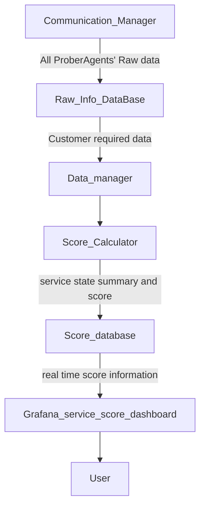

# Cyber Exercise Service and Resource Health Monitor

[us English](README.md) | **cn 中文**

**项目设计目的**：Cyber Exercise Service and Resource Health Monitor 被设计为一个集成的监控和可观测性工具集，旨在支持中等规模的网络演习和网络演练活动。它旨在提供实时可视化软件，用于展示演习生命周期中包括硬件、虚拟机 (VMs)、容器、应用程序和软件服务在内的资源的可用性、状态和性能。


该系统旨在支持不同演习发起和参与团队的一系列操作场景，特别是在网络安全培训和仿真环境中：

- **演习资源监控**：跟踪网络演习期间使用的节点和服务的健康状况和可用性，确保环境保持稳定和功能正常。
- **攻击检测与影响感知**：识别关键服务（例如 NTP servers）中的异常行为或中断，这可能表明正在进行或已完成的网络攻击。
- **实时可视化**：观察网络安全演练期间节点和服务状态的动态变化，使参与者和组织者能够了解不断演变的情况。

此外，该系统还集成了自动化机制，用于检测和记录攻击活动以及相应的防御行动，从而实现准确的事件跟踪和数字取证分析。

```python
# Author:      Yuancheng Liu
# Created:     2026/03/20
# Version:     v_0.0.3
# Copyright:   Copyright (c) 2026 LiuYuancheng
# License:     MIT License
```

**Table of Contents**

[TOC]

------

### 1. 引言

该系统旨在持续评估节点、虚拟机 (VMs)、服务和应用程序的执行状态/进度，并根据用户定义的要求或预配置的评分模型生成健康评估分数。

#### 1.1 摘要与概述

目前有多种软件可以监控系统或集群中不同服务的健康状态，但专门用于提供网络演习/演练的可用性和运行状态的实时可见性的软件并不多。Cyber Exercise Service and Resource Health Monitor System 的关键设计目标是最大限度地降低部署复杂性。它避免了对现有网络路由配置（例如 switches）进行重大修改，并减少了在被监控节点上安装额外库的需求。这种轻量级且灵活的方法允许用户将监控系统快速集成到现有的网络演习基础设施中，特别是在网络靶场和网络演练环境中。

该系统支持不同演习团队的多种用例需求，包括在网络演习期间监控基础设施健康状况、检测对关键服务（如 NTP servers）的潜在攻击，以及在网络安全演练和事件期间可视化系统状态转换。

#### 1.2 开发与使用背景

网络演习团队根据其在模拟、防御或管理网络安全事件中的角色进行分类。该系统是根据不同团队的使用需求反馈开发的，如下所示：


借助监控系统提供的功能，网络演习/演练的组织者和参与者将更好地了解演习进度，识别潜在问题并有效应对。这提高了态势感知能力，增强了团队间的协调，并确保了复杂网络靶场场景的顺利执行。该系统的主要特性和功能旨在满足参与网络演习的多个团队的运营需求：

- **黑队（裁判组）**：提供整个演习的概览，包括团队状态、评分、资源可用性和总体防御进度，从而实现准确的评估和决策。
- **绿队（设置组）**：通过在准备和执行阶段提供对系统健康状况和服务就绪情况的详细洞察，支持环境设置、测试和调试。
- **蓝队（防守组）**：实现对防御基础设施和服务的实时监控，帮助防御者快速检测异常并评估系统状况。
- **红队（攻击组）**：协助报告攻击进度，并评估攻击行动对目标环境的有效性和影响。
- **黄队（运营组）**：促进模拟正常用户行为，以增强真实性并在演习环境中提供基线活动。
- **紫队（记录组）**：记录演习事件的完整时间线并归档日志，以供演习后分析、学习和改进。

------

### 2. 系统概述

#### 2.1 三层系统架构

该系统将重点监控网络演习的三个主要部分，从硬件到人员：网络演习基础设施部分、网络靶场服务部分和参与者活动部分，如下图所示：


- **网络演习基础设施**：“硬件、节点和线路”层包括 `Resource Utilization`、`Network Latency & Throughput`、`Connectivity Status` 和 `Cluster Health/Uptime`。
- **网络靶场资源和服务**：“软件和功能服务”层包括 `Core Network Services`、`Traffic Generation Integrity`、`Scenario Injection Delivery` 和 `Logging Pipeline`。
- **网络演练参与者活动**：“用户行为”层，即参与者正在做什么，例如 `Command Line & Tool Usage`、`Incident Response Timeline`、`Communication Flow` 和 `Task Completion Rate`。

#### 2.2 服务健康监控结构

Cluster Service Health Monitor 将设置在第二层，评估网络安全计算集群（节点、服务、系统功能和文件系统）中关键组件的可用性和完整性。程序模块图如下所示：


该系统由三个主要模块组成：

**2.2.1 Service Prober Repository**

一个集中的服务探测功能库，旨在验证各种服务和协议（如 NTP、FTP、VNC 和 SSH）的运行状态。每个探测器负责检测特定服务或功能是否正常运行并按预期响应。

**2.2.2 Prober Agent**

Prober Agent 将从服务探测器库中导入模块，以完成整个集群的检查任务。其主要功能包括：

- **基于配置文件的配置**：用户可以定义自定义监控配置文件，根据特定要求对探测功能进行分组和组织。
- **灵活的部署模式**：代理可以在内部（节点内）运行，监控系统级指标，如资源使用、文件系统更改、用户活动和进程执行，也可以在外部运行，评估服务接口。
- **数据转换与中继**：为避免修改现有网络路由配置，代理可以从其他代理检索和中继数据，有效地形成一个分布式数据收集总线。
- **集中报告**：所有收集到的监控数据都发送到 Monitor Hub 进行可视化和进一步分析。

**2.2.3 Monitor Hub**

Monitor Hub 作为数据聚合、可视化和评估的中心平台。它包括两个数据库，用于存储监控数据和历史原始记录。该中心提供：

- 一个基于网络的仪表板，用于实时可视化集群健康状况和服务状态。
- 用于集成自定义评分公式或评估功能的接口，允许用户定义如何量化系统健康状况。
- 支持网络演习期间自动决策的分析能力。

------

### 3. 系统设计

#### 3.1 Service Prober Repository 设计

Service Prober Repository 是一个模块化库，提供探测功能，用于验证服务和系统组件的可用性和运行状态。探测器分为两种主要类型：本地服务探测器和网络服务探测器。

**3.1.1 本地服务探测器**

本地服务探测器部署在目标节点内部，用于监控内部系统状态。这些探测器侧重于主机级别的可观测性，包括：

- 资源利用率 (CPU, memory, disk, network bandwidth)
- 用户活动（登录、命令执行、文件修改）
- 程序执行状态（运行进程、服务端口、日志）
- 网络接口和连接状态

本地探测器示例：

| 探测器名称     | 探测范围                              |
| :------------- | :------------------------------------ |
| 资源使用探测器 | CPU %、Memory %、磁盘使用率、网络带宽 |
| 用户行为探测器 | 用户登录、命令执行、文件系统修改      |
| 程序行为探测器 | 进程执行、端口状态、应用程序日志监控  |

**3.1.2 网络服务探测器**

网络服务探测器在外部运行，通过网络接口评估目标服务节点的可用性。这些探测器模拟真实的客户端交互并验证服务级功能。

网络探测器示例：

| 探测器名称       | 探测范围                               |
| :--------------- | :------------------------------------- |
| 服务器活动探测器 | ICMP (ping)、SSH、RDP、VNC、X11 access |
| 服务端口探测器   | 端口扫描（例如 Nmap）以验证开放端口    |
| 服务功能探测器   | 服务的功能验证，例如：                 |
|                  | - NTP：延迟和时间同步精度              |
|                  | - DNS：名称解析正确性                  |
|                  | - DHCP：广播和租约功能                 |
|                  | - FTP：登录和目录列表                  |
|                  | - HTTP/HTTPS：Web 请求/响应验证        |
|                  | - Email：邮件服务可用性                |
|                  | - TCP/UDP services：协议特定通信       |
|                  | - Database：连接和查询验证             |

这种分层探测设计确保了被监控集群的系统级和服务级可见性。

#### 3.2 Prober Agent 设计

Prober Agent 作为监控系统的执行和编排层。它负责根据用户定义的配置调度、管理和执行多个探测器。它将从 `Prober Repository` 导入库模块，如下图所示的模块导入图：


**3.2.1 主要功能**

- **基于配置文件的配置**：用户可以定义自定义监控配置文件，根据特定监控要求对不同探测器进行分组。
- **灵活部署**：代理可以在节点内部运行，监控本地系统状态，也可以从远程节点外部运行，评估服务接口。
- **通过自定义探测器实现可扩展性**：用户可以集成针对特定服务（例如计费服务器等专有系统）量身定制的自定义探测功能。
- **分布式数据中继机制**：为避免修改现有网络路由配置，代理可以从其他代理检索数据，形成数据转换总线，实现高效数据收集。
- **集中报告**：所有收集到的监控数据都传输到 Monitor Hub 进行聚合、分析和可视化。

**3.2.2 程序工作流程概述**

Prober Agent 按以下顺序运行：

1. 加载预定义的监控配置文件
2. 调度和执行相关探测器
3. 收集本地和/或远程监控数据
4. 可选地聚合来自对等代理的数据
5. 将结构化结果发送到 Monitor Hub

#### 3.3 Service Monitor Hub 设计

Service Monitor Hub 是负责数据聚合、分析、评分和可视化的核心组件。它通过基于网络的仪表板（目前使用 Grafana 实现）为用户提供可操作的洞察。

**3.3.1 核心功能**

- 集群和服务健康状况的实时可视化
- 用户定义评分模型的集成
- 历史数据存储和分析
- 支持网络演习期间的决策

**3.3.2 数据库架构**

Monitor Hub 使用两个专用数据库：

- **原始信息数据库**：存储从 Prober Agents 收集的所有原始监控数据，用于归档和可追溯性目的。
- **评分数据库**：存储处理后的数据，包括计算出的服务可用性分数和汇总的系统状态，基于用户定义的评分功能。

**3.3.3 数据流架构**

Monitor Hub 内的数据处理管道如下图所示：



**3.3.4 数据流描述**

1. **数据收集**：Prober Agents 将原始监控数据发送到 Communication Manager。
2. **数据存储**：原始数据存储在原始信息数据库中。
3. **数据处理**：Data Manager 根据用户要求检索相关数据。
4. **分数计算**：Score Calculator 应用用户定义的公式计算服务健康分数。
5. **数据可视化**：处理后的结果存储在评分数据库中，并通过 Grafana 仪表板实时显示。
6. **用户交互**：用户通过直观的 Web 界面访问洞察。

------

### 4. 监控 Web 仪表板门户

该系统提供了一套基于网络的仪表板，用于可视化实时演习信息并支持不同团队的运营需求。每个仪表板都设计有特定角色的视图，以增强网络演习期间的态势感知、协调和决策。屏幕截图示例如下：


目前支持五种主要类型的仪表板：

- 演习概览仪表板 - 黑队（裁判组）
- 服务健康仪表板 - Blue Team
- 资源可用性仪表板 - 黑队（裁判组）、Red、Blue 和 Purple Teams
- 信息和公告仪表板 - Purple Team（主要）、所有团队（消费者）
- 辅助功能仪表板 - Green Team 和 Yellow Team


#### 4.1 演习概览仪表板

Cyber Exercise Overview Dashboard 主要由黑队（裁判组）使用，用于监控、管理和控制网络演习的整体进度。它提供了一个集中式的、实时的关键操作指标和事件状态视图，从而实现有效的决策和协调。仪表板屏幕截图示例如下：


该仪表板包括以下信息面板：

- **最新更新和实时动态**：显示来自演习现场的最新新闻、公告和实时视频。
- **攻击与防御状态**：可视化演习环境中正在进行的攻击和防御活动的当前状态。
- **团队表现和评分**：面板显示所有 Blue Teams 的分数，以及演习期间提出和解决的工单摘要。
- **资源可用性概览**：提供所有参与团队资源的可用性和健康状况的高级视图。
- **实时事件时间线**：跟踪并显示发生的关键演习事件，提供活动和事件的时间顺序视图。


#### 4.2 服务健康仪表板

网络演习服务健康仪表板旨在供蓝队监控其负责的子演习环境或集群的健康状况、可用性和运行状态。它提供实时洞察，使防御者能够分析系统状况、检测异常、提交事件工单并规划适当的防御行动。仪表板截图如下所示：


每个蓝队都配有根据其分配环境量身定制的专用仪表板。该仪表板提供以下关键信息：

- **节点健康与可用性**：集群内节点的实时状态，包括正常运行时间和运行健康状况。
- **网络拓扑与流量状态**：环境网络结构的可视化，以及当前流量状况和潜在异常。
- **服务与应用状态**：监控集群中的服务可用性和程序执行状态。
- **关键主机活动监控**：跟踪关键节点上的登录活动和命令执行，用于安全审计和异常检测。
- **系统日志与防御得分**：访问集群系统日志和团队当前防御得分，用于绩效跟踪。


#### 4.3 资源可用性仪表板

资源可用性仪表板提供所有演习资源的详细实时视图，包括硬件、虚拟机 (VM)、容器、应用程序和服务。它旨在支持参与网络演习的多个团队的操作和分析需求。仪表板截图如下所示：


此仪表板使不同团队能够执行以下功能：

- **黑（裁判）队**：通过分析资源可用性、系统状态以及行动对整体得分和演习进度的影响来评估团队绩效。
- **红队**：通过观察目标环境中资源可用性和系统行为的变化，评估发起攻击的有效性和影响。
- **绿队**：监控关键节点和主机的连接性和健康状况，支持演习期间的环境验证、故障排除和问题调试。
- **紫队**：存档和审查演习环境的整体资源状态，用于事后分析、报告和知识留存。


####  4.4 信息与公告仪表板

信息与公告仪表板主要由紫队管理，作为网络演习的中央通信和信息门户。它用于发布公告、与参与团队（特别是蓝队）分享更新、存档演习相关材料，并作为主页界面向公众提供选定信息。仪表板截图如下所示：


此仪表板确保一致的沟通，提高信息可访问性，并支持实时协调和演习后文档编制。仪表板包括以下面板：

- **事件日程时间轴面板**：显示演习的总体日程，包括关键里程碑和计划活动。
- **演习进度时间轴面板**：使用新的时间轴系统提供演习事件的实时时间轴，允许用户跟踪正在进行的活动和事件。
- **仪表板列表面板**：提供对系统中所有可用监控仪表板的快速访问。
- **演习日程面板**：呈现详细的日程信息，包括会话分解和特定活动的时间安排。
- **组织委员会面板**：介绍参与演习的组织团队和主要利益相关者。
- **演习文档下载面板**：提供参与者访问相关文档、指南和资源的权限。
- **参与组织显示面板**：展示参与演习的组织，支持可见性和协作。


#### 4.5 辅助功能仪表板

辅助功能仪表板由一组定制仪表板组成，旨在可视化特定功能的执行状态，以满足网络演习的额外操作要求。这些仪表板通过提供对辅助系统和活动的实时洞察，为专业团队提供有针对性的支持。仪表板截图如下所示：


仪表板包括：

- **用户行为模拟仪表板（黄队）**：显示正常用户行为模拟和流量生成活动的状态，有助于在演习环境中维持真实的基线条件。
- **攻击活动监控仪表板（红队）**：可视化正在进行的攻击操作，包括已发起的攻击和自动触发的意外或潜在有害行动，从而更好地跟踪和报告攻击活动。
- **连接与网络支持仪表板（绿队）**：监控互联网连接、VPN 状态和带宽使用情况，以确保整个演习期间基础设施和网络支持的稳定。

------

### 5. 用例示例

Cluster Service Health Monitor 已成功部署在 NCL **AS-06 集群 (COM1-AS06)** 上，以展示其监控中型网络演习环境的能力。在此部署中，系统共监控跨多个关键基础设施组件的 **17 个节点**和 **71 项服务**。详细系统工作流程如下图所示：


#### 5.1 监控集群概览

监控目标和服务总结如下：

| 探测目标服务集群 | 节点数量 | 检查服务                                                     |
| :--------------- | :------- | :----------------------------------------------------------- |
| 防火墙           | 1        | icmp, ssh, http-alt, http-proxy, ident, blackice-icecap, http, https |
| Openstack        | 4        | icmp, ssh, http-alt, upnp, mysql, https, vnc                 |
| Kypo-Crp         | 3        | icmp, ssh, https, vnc, X11, X11:1-Win                        |
| CTF              | 2        | icmp, ssh, http, vnc, X11, X11:1-Win                         |
| GPU              | 3        | icmp, ssh, vnc, Nvidia-smi                                   |
| 支持             | 4        | NTP, ftp, file.                                              |

#### 5.2 监控仪表板概览

监控仪表板：


------

> Last edit by LiuYuancheng (liu_yuan_cheng@hotmail.com) at 31/03/2026, if you have any problem or find anu bug, please send me a message .